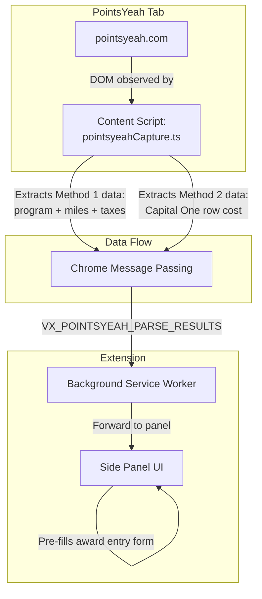

# PointsYeah Booking Methods — UX Design Document

> **Status:** Draft  
> **Author:** VentureXify Architecture  
> **Date:** 2026-02-17  
> **Scope:** Guide Capital One Venture X users through PointsYeah's 3 booking methods  
> **Dependencies:** [`transferPartnerRegistry.ts`](../src/engine/transferPartnerRegistry.ts), [`pointsyeah.ts`](../src/engine/pointsyeah.ts), [`AppRedesigned.tsx`](../src/ui/sidepanel/AppRedesigned.tsx)

---

## Executive Summary

When users search PointsYeah via our extension, they encounter **three "ways to book"** per flight result — book with airline miles, transfer from a credit card, or buy points. This confuses users because our extension is specifically for Capital One Venture X cardholders who only care about their Capital One miles cost.

**Recommended approach:** Guide users to look at **Method 1 data** (airline program + miles + taxes) since our engine already applies transfer ratios from the centralized registry. Add a **secondary "quick entry" option** for users who prefer to read the Capital One cost directly from Method 2. Pair this with a **contextual guidance overlay** that tells users exactly what to look for before and after visiting PointsYeah.

This approach:
- Requires **minimal code changes** (the engine already handles transfer ratio conversion via [`c1MilesNeeded()`](../src/engine/transferPartnerRegistry.ts:344))
- **Leverages existing infrastructure** (22-partner registry, per-leg entry, real-time ratio display)
- Reduces confusion by **telling users which number to copy** from PointsYeah
- Keeps a clean path toward future auto-capture

---

## Table of Contents

1. [Analysis of the Three Booking Methods](#1-analysis-of-the-three-booking-methods)
2. [Instructional Guidance — Before PointsYeah](#2-instructional-guidance--before-pointsyeah)
3. [Simplified Data Entry — Dual Input Mode](#3-simplified-data-entry--dual-input-mode)
4. [Guidance Overlay & Tips — After PointsYeah](#4-guidance-overlay--tips--after-pointsyeah)
5. [Value Assessment Enhancement](#5-value-assessment-enhancement)
6. [Future: Auto-Capture Architecture](#6-future-auto-capture-architecture)
7. [Implementation Plan](#7-implementation-plan)
8. [Technical Notes — Component Changes](#8-technical-notes--component-changes)

---

## 1. Analysis of the Three Booking Methods

### What PointsYeah Shows

When a user expands a flight result on PointsYeah, they see three sections:

| # | Method | What it shows | Relevant to our users? |
|---|--------|---------------|------------------------|
| 1 | **Book directly with airline** | Airline program name, partner miles required, taxes/fees | **YES** — this is the raw data our engine needs |
| 2 | **Transfer from credit card** | Multiple bank rows (Chase, Citi, Amex, Capital One) with each bank's point cost | **PARTIALLY** — the Capital One row shows the final C1 cost, but includes other banks which clutter the view |
| 3 | **Buy points** | Cash cost to purchase airline miles directly | **NO** — almost never good value for Venture X users |

### Why This Causes Confusion

```
User flow today:
1. User clicks "Check Awards" → PointsYeah opens
2. User finds a flight result, expands it
3. User sees 3 methods × multiple programs = information overload
4. User doesn't know which number to copy back to the extension
5. User might enter the WRONG number (e.g., Chase cost instead of airline miles)
```

### Key Insight: Method 1 vs Method 2 as Input Source

| Approach | Data entered | Engine work | Pros | Cons |
|----------|-------------|-------------|------|------|
| **Method 1 data** (airline miles + taxes) | Program name, 46,000 pts, $44.20 | Engine applies transfer ratio via registry | Engine validates and converts; supports per-leg with different programs; audit trail shows full math | User must identify the correct airline program section |
| **Method 2 data** (Capital One row) | 76,700 Capital One pts, $44.20 | None needed — already in C1 miles | Simplest for user; one number to find | Loses program info; can't validate ratio; no per-program audit trail; user might accidentally grab Chase/Citi row |

**Recommendation: Default to Method 1 data, offer Method 2 as a "quick entry" shortcut.**

This preserves the engine's ability to validate, audit, and display per-program breakdowns while offering an escape hatch for users who find Method 2 easier.

---

## 2. Instructional Guidance — Before PointsYeah

### 2.1 Enhanced "Check Awards" Section (Phase: ASK)

The current "ask" phase in [`VerdictSection`](../src/ui/sidepanel/AppRedesigned.tsx:2326) shows a generic "Transfer partner awards might beat both prices" message. We should replace this with targeted guidance.

**Wireframe: Enhanced ASK phase**

```
┌─────────────────────────────────────────────┐
│  ✨  Want to explore award options?          │
│     Transfer partner awards might beat both  │
│                                              │
│  ⓘ What you'll see on PointsYeah            │
│  ┌─────────────────────────────────────────┐ │
│  │ PointsYeah shows 3 "ways to book."     │ │
│  │ You only need:                          │ │
│  │                                         │ │
│  │ ✅ Method 1: Airline program miles      │ │
│  │    (e.g., "JetBlue TrueBlue: 46,000    │ │
│  │     pts + $44 tax")                     │ │
│  │                                         │ │
│  │ ❌ Ignore "Transfer from credit card"   │ │
│  │ ❌ Ignore "Buy points"                  │ │
│  │                                         │ │
│  │ We'll handle the Capital One            │ │
│  │ conversion automatically.               │ │
│  └─────────────────────────────────────────┘ │
│                                              │
│  [ Show Verdict ]   [ Check Awards → ]       │
└─────────────────────────────────────────────┘
```

### 2.2 Implementation Details

The guidance block replaces the current [`ExpandableInfo`](../src/ui/sidepanel/AppRedesigned.tsx:2339) component:

```
Current:
  <ExpandableInfo
    summary="How do transfer partners work?"
    detail="Transfer partners can sometimes beat both portal and direct prices..."
  />

Proposed:
  <ExpandableInfo
    summary="What you'll see on PointsYeah"
    detail={<PointsYeahMethodGuide />}
  />
```

Where `PointsYeahMethodGuide` is a small presentational component showing the 3-method breakdown with checkmarks and X marks. This leverages the existing [`ExpandableInfo`](../src/ui/sidepanel/AppRedesigned.tsx:313) progressive-disclosure pattern — collapsed by default so it doesn't overwhelm users who already know PointsYeah.

### 2.3 Design Rationale

- **Collapsed by default** — experienced users skip it; new users tap to learn
- **Directive language** ("You only need…") — reduces cognitive load vs explaining all 3 methods
- **"We'll handle the conversion"** — builds trust that the user doesn't need to do math
- **Visual checkmarks/X marks** — faster to scan than reading paragraphs

---

## 3. Simplified Data Entry — Dual Input Mode

### 3.1 Recommended Approach: Entry Source Toggle

Add a toggle at the top of the INPUT phase that lets users choose how they want to enter data:

```
┌──────────────────────────────────────────────┐
│  Enter award details from PointsYeah         │
│                                              │
│  How are you entering the data?              │
│  ┌────────────────┐ ┌────────────────────┐   │
│  │ ✅ Airline      │ │    Capital One     │   │
│  │    Miles        │ │    Miles           │   │
│  │  (recommended)  │ │  (quick entry)     │   │
│  └────────────────┘ └────────────────────┘   │
│                                              │
│  ⓘ Tip: Look under "Book directly with      │
│  airline program" on PointsYeah              │
└──────────────────────────────────────────────┘
```

### 3.2 Mode A: Airline Miles Entry (Default — Current Behavior, Enhanced)

This is the **existing** entry mode. User enters:
- Transfer program (dropdown from registry)
- Partner miles required
- Taxes/fees

Engine applies transfer ratio via [`c1MilesNeeded()`](../src/engine/transferPartnerRegistry.ts:344) and shows real-time conversion for non-1:1 partners.

**Enhancement:** Add an inline tip above the program dropdown:

```
┌──────────────────────────────────────────────┐
│  💡 On PointsYeah, look for "Book directly   │
│  with airline program" → copy the program     │
│  name, miles, and taxes from there.           │
│                                              │
│  Program: [ Turkish Miles&Smiles  ▼ ]        │
│           ✓ 1:1 — 37,000 C1 miles needed     │
│                                              │
│  Miles required: [ 37,000        ] pts       │
│  Taxes & fees:   [ $85.80   ] optional       │
└──────────────────────────────────────────────┘
```

### 3.3 Mode B: Capital One Miles Entry (Quick Entry — New)

For users who prefer to read the Capital One row from Method 2:

```
┌──────────────────────────────────────────────┐
│  💡 On PointsYeah, look for "Transfer points │
│  from credit card" → Capital One row.         │
│  Copy the Capital One points number.          │
│                                              │
│  Capital One miles needed:                    │
│  [ 76,700                        ] C1 miles  │
│                                              │
│  Taxes & fees:                                │
│  [ $44.20                        ] optional  │
│                                              │
│  ⚠️ Quick entry mode: we won't be able to   │
│  show per-program breakdowns or verify the   │
│  transfer ratio. For full details, use       │
│  "Airline Miles" mode.                        │
└──────────────────────────────────────────────┘
```

**Key differences from Mode A:**
- No program dropdown — user enters C1 miles directly
- No ratio conversion needed — value is already in C1 miles
- Simpler form — just 2 fields
- Trade-off caveat shown inline
- Leg direction still available (outbound/return/roundtrip) since PointsYeah returns one-way results

### 3.4 Data Model Changes

Add a new field to [`AwardLeg`](../src/ui/sidepanel/AppRedesigned.tsx:1444) to indicate entry source:

```typescript
interface AwardLeg {
  // ... existing fields ...
  
  /** How the user entered this data */
  entrySource: 'airline_miles' | 'c1_miles_direct';
  
  /** When entrySource is 'c1_miles_direct', partnerMiles === c1Miles
      and program/programName are 'unknown'/'Capital One Direct Entry' */
}
```

When `entrySource === 'c1_miles_direct'`:
- `program` = `'c1_direct'`
- `programName` = `'Capital One (direct entry)'`
- `partnerMiles` = same as `c1Miles` (no conversion)
- `transferRatio` = `1.0`
- `ratioLabel` = `'direct'`

This means the existing comparison engine, verdict card, and audit trail all work without changes — they already consume `c1Miles` as the primary value.

### 3.5 Separate Legs Compatibility

Both entry modes work with the existing **separate legs vs round-trip** toggle. PointsYeah returns one-way results, so separate legs is already the default (`awardEntryMode` defaults to `'separate'` in the current code at [line 1548](../src/ui/sidepanel/AppRedesigned.tsx:1548)).

Users can mix modes per leg (e.g., outbound in Mode A with Turkish Miles&Smiles, return in Mode B with direct Capital One entry). This is an edge case but falls out naturally from the design.

---

## 4. Guidance Overlay & Tips — After PointsYeah

### 4.1 Enhanced "Searching" Phase

The current "searching" phase ([line 2368](../src/ui/sidepanel/AppRedesigned.tsx:2368)) shows a collapsed tip with generic guidance. Replace it with method-specific instructions.

**Wireframe: Enhanced SEARCHING phase**

```
┌─────────────────────────────────────────────┐
│  🔍  PointsYeah opened                      │
│     Find an award option to compare          │
│                                              │
│  ┌─────────────────────────────────────────┐ │
│  │  📋 What to copy from PointsYeah:      │ │
│  │                                         │ │
│  │  1. Find your flight, tap to expand     │ │
│  │                                         │ │
│  │  2. Under "Book directly with airline   │ │
│  │     program":                           │ │
│  │     • Program name (e.g., "JetBlue      │ │
│  │       TrueBlue")                        │ │
│  │     • Miles required (e.g., "46,000")   │ │
│  │     • Taxes/fees (e.g., "$44.20")       │ │
│  │                                         │ │
│  │  ─ OR quick alternative ─               │ │
│  │                                         │ │
│  │  Under "Transfer from credit card":     │ │
│  │     • Capital One row → points needed   │ │
│  │       (e.g., "76,700 pts")              │ │
│  │     • Same taxes/fees as above          │ │
│  │                                         │ │
│  │  ⚠️ IGNORE "Buy points" — almost       │ │
│  │  never worth it for Venture X users     │ │
│  └─────────────────────────────────────────┘ │
│                                              │
│  DXB → LAX • Feb 20, 2026 (roundtrip)       │
│                                              │
│  [ I found an award ]   [ 🔄 ]              │
│  No good awards → Show verdict               │
└─────────────────────────────────────────────┘
```

### 4.2 Method 3 Warning

The "Buy points" method should be explicitly called out as a bad deal. When the user is on the INPUT phase, add a small persistent banner:

```
┌─────────────────────────────────────────────┐
│  ⚠️ Don't enter "Buy Points" prices.        │
│  Buying airline miles typically costs         │
│  1.4–2.5¢ each — worse than your C1 miles    │
│  which are worth 1.5–2.0¢ via transfers.     │
└─────────────────────────────────────────────┘
```

This uses the existing [`ExpandableInfo`](../src/ui/sidepanel/AppRedesigned.tsx:313) component with `variant="amber"` for the warning style.

### 4.3 Inline Context Tips in Input Fields

When the user is entering data in the INPUT phase, show contextual helper text:

**For the Miles input field:**
```
Miles required: [ 46,000 ] pts
💡 This is under "Book directly with airline program" on PointsYeah
```

**For the Taxes field:**
```
Taxes & fees: [ $44.20 ] optional
💡 Same taxes shown in all 3 methods — copy from any
```

**For the Capital One Miles input (Mode B):**
```
Capital One miles needed: [ 76,700 ] C1 miles
💡 Find "Capital One" under "Transfer points from credit card"
   ⚠️ Make sure you pick the Capital One row, not Chase/Citi/Amex
```

### 4.4 Visual Reference: PointsYeah Layout Map

Consider adding a small visual schematic showing where to find data on PointsYeah. This would be a static illustration, not a screenshot (to avoid copyright/trademark issues):

```
┌─────────────────────────────────────────────┐
│  📖 Where to look on PointsYeah             │
│                                              │
│  ┌──── Flight Result ─────────────────────┐ │
│  │                                         │ │
│  │  ┌── Method 1 ──────────────────────┐  │ │
│  │  │ ✅ "Book directly with airline"   │  │ │
│  │  │    → Copy program + miles + taxes │  │ │
│  │  └──────────────────────────────────┘  │ │
│  │                                         │ │
│  │  ┌── Method 2 ──────────────────────┐  │ │
│  │  │ 🔶 "Transfer from credit card"   │  │ │
│  │  │    → OR copy Capital One row     │  │ │
│  │  │    ❌ Ignore Chase/Citi/Amex     │  │ │
│  │  └──────────────────────────────────┘  │ │
│  │                                         │ │
│  │  ┌── Method 3 ──────────────────────┐  │ │
│  │  │ ❌ "Buy points" — skip this      │  │ │
│  │  └──────────────────────────────────┘  │ │
│  └─────────────────────────────────────────┘ │
└─────────────────────────────────────────────┘
```

This would be shown as a collapsed ExpandableInfo ("📖 Where to look on PointsYeah") inside the SEARCHING or INPUT phase.

---

## 5. Value Assessment Enhancement

### 5.1 Capital One Transfer Cost Display

When the user enters airline miles (Mode A), the extension already shows the C1 cost via the ratio indicator at [lines 2507–2521](../src/ui/sidepanel/AppRedesigned.tsx:2507). **Enhancement:** Make this more prominent:

```
Program: [ JetBlue TrueBlue ▼ ]
Miles:   [ 46,000 ] pts

┌─── Your Capital One Cost ──────────────────┐
│  ⚠️ JetBlue uses 5:3 ratio                │
│  46,000 TrueBlue pts = 76,700 C1 miles     │
│                                             │
│  This matches what PointsYeah shows under   │
│  "Transfer from credit card → Capital One"  │
└─────────────────────────────────────────────┘
```

This serves as **validation** — the user can cross-check that the number our engine computed matches what PointsYeah displayed. If they don't match, something was entered incorrectly.

### 5.2 Portal Comparison in Verdict

When the 3-way comparison verdict shows, add explicit callouts when portal beats transfer:

```
┌─────────────────────────────────────────────┐
│  Portal    Direct    Award                   │
│  $904      $1,104    $44 + 76.7k mi         │
│            👑                                │
│                                              │
│  💡 At your 1.5¢/mi valuation:              │
│  Award effective cost: $44 + $1,151 = $1,195│
│  → Portal is actually cheaper!               │
│                                              │
│  Award CPP: 1.12¢/mi (below 1.5¢ threshold) │
│  ⚠️ Low value — portal or direct is better  │
└─────────────────────────────────────────────┘
```

This already partially exists in the current verdict ([lines 2884–2894](../src/ui/sidepanel/AppRedesigned.tsx:2884)) which shows a warning when CPP < 1.0¢. **Enhancement:** Lower the "consider alternatives" threshold to the user's mile valuation (e.g., 1.5¢) rather than the hard-coded Travel Eraser floor of 1.0¢.

### 5.3 "Buy Points" Comparison (Deferred — Low Priority)

Adding a "Buy Points" comparison column is **not recommended** for the current release:
- It would require scraping per-program buy rates (varies by airline, promotional pricing)
- The extension's purpose is Capital One miles optimization, not airline points arbitrage
- The guidance to ignore Method 3 is simpler and more effective

If needed in the future, it could be added as a fourth row in the audit trail showing "Cash cost to buy equivalent airline miles: $X" for reference.

---

## 6. Future: Auto-Capture Architecture

### 6.1 Rationale

Manual entry works but adds friction. A future content script on `pointsyeah.com` could auto-capture award options and pre-fill the entry form.

### 6.2 High-Level Architecture



### 6.3 Key Design Decisions for Auto-Capture

1. **Capture Method 1 data** (airline program + miles + taxes) as the primary extraction target. This gives the engine maximum information.

2. **Also capture the Capital One row from Method 2** as a validation checksum — if `c1MilesNeeded(program, method1Miles)` doesn't match the Method 2 Capital One value, flag a warning (possible extraction error or ratio change).

3. **Use the existing message types** already defined in [`pointsyeah.ts`](../src/engine/pointsyeah.ts:183):
   - `VX_POINTSYEAH_PARSE_RESULTS` — content script → background
   - `VX_POINTSYEAH_PARSE_RESULTS_RESPONSE` — background → content script

4. **DOM extraction strategy:**
   - PointsYeah is a React SPA — wait for results to render (use [`MutationObserver`](../src/lib/extraction/spaWatch.ts) pattern from existing SPA extraction code)
   - Look for the expanded flight card's "Ways to Book" section
   - Parse the tabular structure for program names, mile amounts, and tax values
   - Use existing [`parseMoney()`](../src/lib/extraction/parseMoney.ts) for currency parsing

5. **User-initiated capture** (not auto-scrape): Show a "Import from PointsYeah" button in the extension when user is on a PointsYeah results page. This respects user agency and avoids background scraping concerns.

6. **manifest.json change:** Add `"matches": ["*://www.pointsyeah.com/*"]` to content scripts. This is a new host permission and requires user consent on extension update.

### 6.4 Auto-Capture is Phase 2

This document focuses on the **manual guidance improvements** (Phase 1). Auto-capture should be implemented after the guidance UX is validated and user feedback confirms the data entry friction is worth solving.

---

## 7. Implementation Plan

### Priority 1: Instructional Guidance (Lowest Effort, Highest Impact)

- [ ] Replace generic "How do transfer partners work?" tip in ASK phase with PointsYeah-specific 3-method guide
- [ ] Replace generic "What to look for on PointsYeah" tip in SEARCHING phase with step-by-step copy instructions
- [ ] Add "Buy points" warning banner in INPUT phase
- [ ] Add contextual helper text under each input field

**Components changed:** [`AppRedesigned.tsx`](../src/ui/sidepanel/AppRedesigned.tsx) — VerdictSection ASK, SEARCHING, and INPUT phases only. Content-only changes (strings and small React nodes), no logic changes.

### Priority 2: Dual Entry Mode (Medium Effort, High Impact)

- [ ] Add entry source toggle ("Airline Miles" vs "Capital One Miles") at top of INPUT phase
- [ ] Create "Capital One Miles" quick entry form (2 fields: C1 miles + taxes)
- [ ] Extend [`AwardLeg`](../src/ui/sidepanel/AppRedesigned.tsx:1444) with `entrySource` field
- [ ] Add `handleCalculateAward()` path for `c1_miles_direct` entry (skip ratio lookup)
- [ ] Update audit trail to reflect entry source ("Direct C1 miles entry — ratio not verified")

**Components changed:** [`AppRedesigned.tsx`](../src/ui/sidepanel/AppRedesigned.tsx) — AwardLeg interface, INPUT phase form, handleCalculateAward logic.

### Priority 3: Enhanced Value Display (Low Effort, Medium Impact)

- [ ] Make C1 cost calculation more prominent for non-1:1 partners (visual card instead of small text)
- [ ] Add cross-check text: "This matches the Capital One row on PointsYeah"
- [ ] Lower "consider alternatives" threshold from 1.0¢ to user's mile valuation
- [ ] Add "portal is cheaper" callout in verdict when award CPP < mile valuation

**Components changed:** [`AppRedesigned.tsx`](../src/ui/sidepanel/AppRedesigned.tsx) — ratio indicator in INPUT phase, verdict bullets in VerdictSection.

### Priority 4: Visual Guide Component (Medium Effort, Medium Impact)

- [ ] Create `PointsYeahMethodGuide` presentational component
- [ ] Add collapsed "📖 Where to look" visual schematic in SEARCHING phase
- [ ] Consider adding an animated highlight or callout for first-time users

**Components changed:** New component `PointsYeahMethodGuide.tsx`, imported in [`AppRedesigned.tsx`](../src/ui/sidepanel/AppRedesigned.tsx).

### Phase 2 (Future): Auto-Capture

- [ ] Create `src/content/pointsyeahCapture.ts` content script
- [ ] Add PointsYeah host permission to [`manifest.json`](../manifest.json)
- [ ] Implement DOM extraction for Method 1 and Method 2 data
- [ ] Add "Import from PointsYeah" button in extension when on PointsYeah
- [ ] Add validation: compare extracted C1 cost vs engine-computed C1 cost

---

## 8. Technical Notes — Component Changes

### 8.1 Files Affected (Phase 1)

| File | Change Type | Description |
|------|-------------|-------------|
| [`AppRedesigned.tsx`](../src/ui/sidepanel/AppRedesigned.tsx) | Modify | Update ASK/SEARCHING/INPUT phase content; add entry source toggle; add C1 direct entry form |
| [`pointsyeah.ts`](../src/engine/pointsyeah.ts) | Modify | Update [`POINTSYEAH_TIPS`](../src/engine/pointsyeah.ts:220) array with method-specific guidance |
| New: `PointsYeahMethodGuide.tsx` | Create | Presentational component for the 3-method visual guide |

### 8.2 State Additions in VerdictSection

```typescript
// New state: entry source toggle per leg
type EntrySource = 'airline_miles' | 'c1_miles_direct';
const [obEntrySource, setObEntrySource] = useState<EntrySource>('airline_miles');
const [rtEntrySource, setRtEntrySource] = useState<EntrySource>('airline_miles');
const [combinedEntrySource, setCombinedEntrySource] = useState<EntrySource>('airline_miles');

// New state: C1 direct miles input (Mode B)
const [obC1Miles, setObC1Miles] = useState('');
const [rtC1Miles, setRtC1Miles] = useState('');
const [combinedC1Miles, setCombinedC1Miles] = useState('');
```

### 8.3 handleCalculateAward Extension

Add a branch for `c1_miles_direct` entry in the existing [`handleCalculateAward()`](../src/ui/sidepanel/AppRedesigned.tsx:1672):

```typescript
// Inside the leg-building logic:
if (entrySource === 'c1_miles_direct') {
  const c1Miles = parseInt(c1MilesInput.replace(/,/g, ''), 10);
  if (isNaN(c1Miles) || c1Miles < 1000) {
    setInputError('Enter valid Capital One miles (at least 1,000)');
    return;
  }
  
  legs.push({
    direction,
    program: 'c1_direct',
    programName: 'Capital One (direct entry)',
    partnerMiles: c1Miles,  // Same as c1Miles — no conversion
    c1Miles,
    taxes,
    taxesEstimated: !hasValidTax,
    transferRatio: 1.0,
    ratioLabel: 'direct',
    cpp: 0,  // Computed later
    entrySource: 'c1_miles_direct',
  });
}
```

### 8.4 POINTSYEAH_TIPS Update

Replace the generic tips in [`pointsyeah.ts`](../src/engine/pointsyeah.ts:220) with method-specific guidance:

```typescript
export const POINTSYEAH_TIPS: PointsYeahTip[] = [
  {
    number: 1,
    text: 'PointsYeah shows 3 "ways to book" — focus on the first one: "Book directly with airline program."',
    important: true,
  },
  {
    number: 2,
    text: 'Copy the program name, miles required, and taxes/fees. We handle the Capital One conversion.',
  },
  {
    number: 3,
    text: 'Quick alternative: find "Capital One" under "Transfer from credit card" and enter that number directly.',
  },
  {
    number: 4,
    text: 'Ignore "Buy points" — purchasing airline miles is almost never good value for Venture X holders.',
    important: true,
  },
  {
    number: 5,
    text: 'PointsYeah shows one-way results. Search outbound and return separately, then enter both legs.',
  },
];
```

### 8.5 Backward Compatibility

All changes are additive:
- The existing entry mode (airline miles) remains the default
- The `entrySource` field defaults to `'airline_miles'` for existing entries
- No changes to the [`transferPartnerRegistry`](../src/engine/transferPartnerRegistry.ts), [`simpleCompare()`](../src/engine/strategyEngine.ts:843), or [`ProgressiveVerdictCard`](../src/ui/components/glass/ProgressiveVerdictCard.tsx)
- Audit trail naturally reflects the entry source via `programName` field

---

## Appendix: Decision Log

| Decision | Rationale |
|----------|-----------|
| Default to Method 1 input | Engine can validate ratio, show per-program breakdown, and cross-check against Method 2 |
| Offer Method 2 as secondary | Some users find it easier; reduces barrier to entry |
| Don't add Method 3 comparison | Buying airline miles is a different use case; adds complexity without value for Venture X users |
| Collapsed guidance by default | Respects experienced users while helping newcomers |
| Phase auto-capture to Phase 2 | Manual guidance + dual entry mode solves 80% of the confusion with 20% of the effort |
| Lower CPP threshold to user's valuation | 1.0¢ floor is too permissive; user's own valuation (default 1.5¢) is a better "worth it" threshold |
