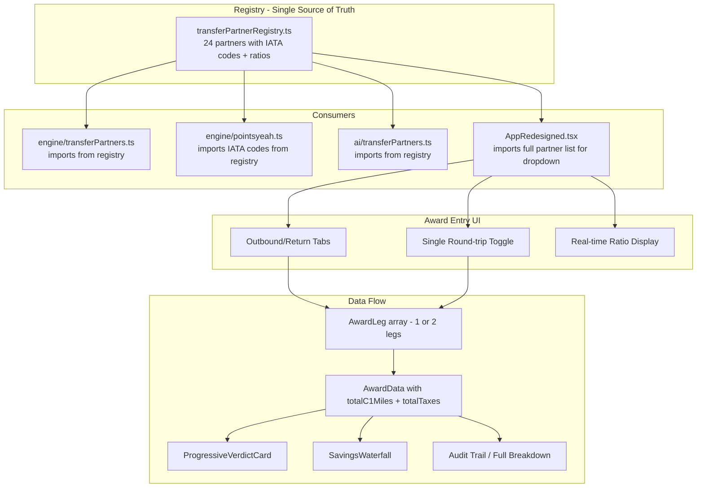
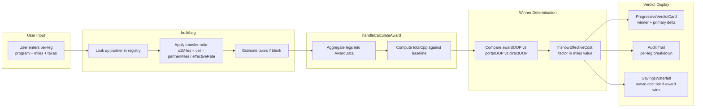
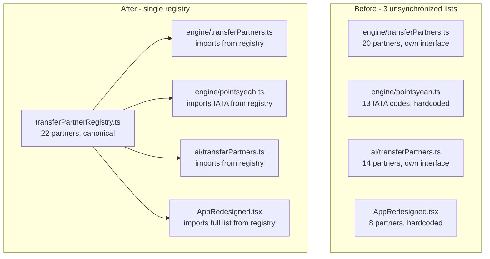

# PointsYeah Award Flow Enhancement Plan

> **✅ IMPLEMENTATION COMPLETE** — All subtasks implemented and TypeScript-verified as of 2026-02-12. See git log for changes across 7 files.

> **Status:** ✅ Complete — All 7 subtasks implemented
> **Author:** VentureXify Architecture
> **Date:** 2026-02-11
> **Scope:** Unified transfer partner registry, outbound/return award entry, data propagation to verdict

---

## Table of Contents

1. [Problem Statement](#1-problem-statement)
2. [Architecture Overview](#2-architecture-overview)
3. [Unified Transfer Partner Registry](#3-unified-transfer-partner-registry)
4. [Outbound/Return Award Entry UI](#4-outboundreturn-award-entry-ui)
5. [Data Model: AwardLeg & AwardData](#5-data-model-awardleg--awarddata)
6. [Data Flow: Award Entry → Verdict](#6-data-flow-award-entry--verdict)
7. [File-by-File Change Plan](#7-file-by-file-change-plan)
8. [Implementation Subtasks](#8-implementation-subtasks)
9. [Testing Strategy](#9-testing-strategy)
10. [Migration & Backward Compatibility](#10-migration--backward-compatibility)

---

## 1. Problem Statement

### Current State — Three Unsynchronized Partner Lists

The codebase maintains **three separate, inconsistent** transfer partner definitions:

| File | Partners Listed | Issues |
|------|----------------|--------|
| [`engine/transferPartners.ts`](../src/engine/transferPartners.ts:22) | 20 partners | Includes Copa ConnectMiles (no longer a C1 partner Jan 2026); Emirates ratio listed as 1:1 (should be 2:1.5); JetBlue ratio listed as 1:1 (should be 5:3); missing JAL, Etihad; missing I Prefer Hotel Rewards |
| [`engine/pointsyeah.ts`](../src/engine/pointsyeah.ts:46) | 13 IATA codes in `CAPITAL_ONE_PARTNERS` | Uses `AR` for Aeromexico (should be `AM`); includes `VA` (Virgin Australia, not a C1 partner); missing AF, CX, QR, TP, BR, JL, plus all hotel partners |
| [`ai/transferPartners.ts`](../src/ai/transferPartners.ts:15) | 14 partners | Emirates ratio listed as 1:1 (should be 2:1.5); missing 10+ partners; uses different interface shape than engine |

### UI Shows Only 8 of 24 Partners

The hardcoded array in [`AppRedesigned.tsx`](../src/ui/sidepanel/AppRedesigned.tsx:1345) only lists 8 programs:

```typescript
// Current — hardcoded, incomplete, no ratios
const TRANSFER_PARTNERS = [
  { code: 'TK', name: 'Turkish Miles&Smiles' },
  { code: 'EY', name: 'Etihad Guest' },
  { code: 'EK', name: 'Emirates Skywards' },
  { code: 'AV', name: 'Avianca LifeMiles' },
  { code: 'AF', name: 'Air France/KLM' },
  { code: 'BA', name: 'British Airways' },
  { code: 'SQ', name: 'Singapore KrisFlyer' },
  { code: 'QF', name: 'Qantas' },
];
```

### No Per-Leg Award Entry

The current [`AwardData` interface](../src/ui/sidepanel/AppRedesigned.tsx:1334) is flat:

```typescript
interface AwardData {
  program: string;
  miles: number;
  taxes: number;
  taxesEstimated?: boolean;
  cpp: number;
}
```

PointsYeah typically returns **one-way** results. Users often need to search outbound and return separately, potentially using different programs (e.g., Turkish Miles&Smiles outbound, Etihad Guest return). The current UI has no way to capture this.

### Transfer Ratios Not Applied

[`handleCalculateAward()`](../src/ui/sidepanel/AppRedesigned.tsx:1544) treats all partner miles as 1:1 with Capital One miles. For Emirates (2:1.5), JetBlue (5:3), EVA Air (2:1.5), JAL (2:1.5), and Accor (2:1), this produces **incorrect** CPP calculations and winner determinations.

---

## 2. Architecture Overview



---

## 3. Unified Transfer Partner Registry

### 3.1 New File: `src/engine/transferPartnerRegistry.ts`

This becomes the **single source of truth** that all other modules import from.

```typescript
// src/engine/transferPartnerRegistry.ts

export interface RegistryPartner {
  /** Internal stable ID, e.g., 'turkish', 'emirates' */
  id: string;

  /** IATA airline code or hotel shortcode, e.g., 'TK', 'EK', 'CH' */
  iataCode: string;

  /** Display name for UI */
  name: string;

  /** Category */
  type: 'airline' | 'hotel';

  /** Alliance membership, if applicable */
  alliance?: 'Star Alliance' | 'Oneworld' | 'SkyTeam' | 'None';

  /** Transfer ratio from Capital One miles to partner miles/points */
  ratio: {
    /** C1 miles given */
    from: number;
    /** Partner miles/points received */
    to: number;
  };

  /** Computed: ratio.to / ratio.from — the multiplier applied to user-entered partner miles */
  effectiveRate: number;

  /** Human-readable ratio label, e.g., '1:1', '2:1.5', '5:3' */
  ratioLabel: string;

  /** Typical transfer time */
  transferTime: string;

  /** Regions where this partner is most useful */
  regions: string[];

  /** Sweet spot descriptions for AI context */
  sweetSpot?: string;

  /** Average CPP valuation — for AI suggestions */
  avgCpp?: number;

  /** Additional notes */
  notes?: string;
}
```

### 3.2 Complete Partner Data (January 2026)

| # | ID | IATA | Name | Type | Alliance | Ratio | Effective Rate | Label |
|---|-----|------|------|------|----------|-------|----------------|-------|
| 1 | `aeromexico` | AM | Aeromexico Rewards | airline | SkyTeam | 1:1 | 1.0 | 1:1 |
| 2 | `aeroplan` | AC | Air Canada Aeroplan | airline | Star Alliance | 1:1 | 1.0 | 1:1 |
| 3 | `lifemiles` | AV | Avianca LifeMiles | airline | Star Alliance | 1:1 | 1.0 | 1:1 |
| 4 | `avios` | BA | British Airways Executive Club | airline | Oneworld | 1:1 | 1.0 | 1:1 |
| 5 | `cathay` | CX | Cathay Pacific Asia Miles | airline | Oneworld | 1:1 | 1.0 | 1:1 |
| 6 | `etihad` | EY | Etihad Guest | airline | None | 1:1 | 1.0 | 1:1 |
| 7 | `finnair` | AY | Finnair Plus | airline | Oneworld | 1:1 | 1.0 | 1:1 |
| 8 | `flyingblue` | AF | Flying Blue / Air France-KLM | airline | SkyTeam | 1:1 | 1.0 | 1:1 |
| 9 | `qantas` | QF | Qantas Frequent Flyer | airline | Oneworld | 1:1 | 1.0 | 1:1 |
| 10 | `qatar` | QR | Qatar Airways Privilege Club | airline | Oneworld | 1:1 | 1.0 | 1:1 |
| 11 | `krisflyer` | SQ | Singapore Airlines KrisFlyer | airline | Star Alliance | 1:1 | 1.0 | 1:1 |
| 12 | `tapmilesgo` | TP | TAP Miles&Go | airline | Star Alliance | 1:1 | 1.0 | 1:1 |
| 13 | `turkish` | TK | Turkish Airlines Miles&Smiles | airline | Star Alliance | 1:1 | 1.0 | 1:1 |
| 14 | `virginred` | VS | Virgin Red | airline | None | 1:1 | 1.0 | 1:1 |
| 15 | `emirates` | EK | Emirates Skywards | airline | None | 2:1.5 | 0.75 | 2:1.5 |
| 16 | `evaair` | BR | EVA Air Infinity MileageLands | airline | Star Alliance | 2:1.5 | 0.75 | 2:1.5 |
| 17 | `jal` | JL | Japan Airlines Mileage Bank | airline | Oneworld | 2:1.5 | 0.75 | 2:1.5 |
| 18 | `trueblue` | B6 | JetBlue TrueBlue | airline | None | 5:3 | 0.6 | 5:3 |
| 19 | `choice` | CH | Choice Privileges | hotel | — | 1:1 | 1.0 | 1:1 |
| 20 | `wyndham` | WY | Wyndham Rewards | hotel | — | 1:1 | 1.0 | 1:1 |
| 21 | `iprefer` | IP | I Prefer Hotel Rewards | hotel | — | 1:2 | 2.0 | 1:2 |
| 22 | `accor` | AL | Accor Live Limitless | hotel | — | 2:1 | 0.5 | 2:1 |

**Removed from previous list:** Copa ConnectMiles (no longer a C1 transfer partner as of Jan 2026)

**Corrections applied:**
- Emirates: was 1:1 → now 2:1.5 (effectiveRate = 0.75)
- JetBlue: was 1:1 → now 5:3 (effectiveRate = 0.6)
- EVA Air: already correct at 2:1.5
- Added JAL, I Prefer Hotel Rewards (were missing entirely)

### 3.3 Registry Helper Exports

```typescript
// Lookup maps — built once at module load
export const PARTNER_BY_ID: ReadonlyMap<string, RegistryPartner>;
export const PARTNER_BY_IATA: ReadonlyMap<string, RegistryPartner>;

// Filtered views
export function getAirlinePartners(): RegistryPartner[];
export function getHotelPartners(): RegistryPartner[];
export function getPartnersByAlliance(alliance: string): RegistryPartner[];

// Core calculation — how many C1 miles to get X partner miles
export function c1MilesNeeded(partnerMiles: number, partner: RegistryPartner): number;
// Formula: Math.ceil(partnerMiles / partner.effectiveRate)

// Reverse — how many partner miles from X C1 miles
export function partnerMilesFromC1(c1Miles: number, partner: RegistryPartner): number;
// Formula: Math.floor(c1Miles * partner.effectiveRate)

// All airline IATA codes — for PointsYeah URL builder
export const ALL_AIRLINE_IATA_CODES: string[];
// = REGISTRY.filter(p => p.type === 'airline').map(p => p.iataCode)
```

### 3.4 `effectiveRate` Derivation

The `effectiveRate` field simplifies all ratio arithmetic:

```
effectiveRate = ratio.to / ratio.from

Partner Miles → C1 Miles: c1Needed = Math.ceil(partnerMiles / effectiveRate)
C1 Miles → Partner Miles: partnerMiles = Math.floor(c1Miles * effectiveRate)
```

| Partner | ratio.from | ratio.to | effectiveRate | 37,000 partner mi → C1 mi needed |
|---------|-----------|----------|---------------|-----------------------------------|
| Turkish (1:1) | 1 | 1 | 1.0 | 37,000 |
| Emirates (2:1.5) | 2 | 1.5 | 0.75 | 49,334 |
| JetBlue (5:3) | 5 | 3 | 0.6 | 61,667 |
| I Prefer (1:2) | 1 | 2 | 2.0 | 18,500 |
| Accor (2:1) | 2 | 1 | 0.5 | 74,000 |

---

## 4. Outbound/Return Award Entry UI

### 4.1 Entry Mode Toggle

The award input form in the Max Value tab gains a mode toggle:

```
┌─────────────────────────────────────────┐
│  ○ Round-trip award    ○ Separate legs  │
└─────────────────────────────────────────┘
```

- **Round-trip award** (default): Single entry — program, miles, taxes. Produces 1 `AwardLeg` with `direction: 'roundtrip'`.
- **Separate legs**: Two sub-forms — Outbound and Return. Produces 2 `AwardLeg` entries. Each leg has its own program selector, miles, and taxes.

### 4.2 Per-Leg Entry Form

```
┌─────────────────────────────────────────┐
│  ✈️ OUTBOUND                           │
│                                         │
│  Program: [ Turkish Miles&Smiles  ▼ ]   │
│           1:1 — 37,000 C1 miles needed  │
│                                         │
│  Miles required: [ 37,000        ] pts  │
│  Taxes & fees:   [ $85.80   ] optional  │
├─────────────────────────────────────────┤
│  ✈️ RETURN                              │
│                                         │
│  Program: [ Etihad Guest         ▼ ]    │
│           1:1 — 25,000 C1 miles needed  │
│                                         │
│  Miles required: [ 25,000        ] pts  │
│  Taxes & fees:   [ $62.40   ] optional  │
├─────────────────────────────────────────┤
│  TOTALS                                 │
│  62,000 C1 miles + $148 taxes           │
│                                         │
│  [ ✨ Compare All 3 Options ]           │
└─────────────────────────────────────────┘
```

### 4.3 Real-Time Ratio Feedback

When user selects a non-1:1 program, the UI immediately shows:

```
Program: [ Emirates Skywards ▼ ]
         ⚠️ 2:1.5 ratio — 37,000 Emirates mi = 49,334 C1 miles needed
```

For 1:1 partners, show a simple confirmation:
```
Program: [ Turkish Miles&Smiles ▼ ]
         ✓ 1:1 — 37,000 C1 miles needed
```

### 4.4 Program Selector: Full Registry Dropdown

Replace the current 8-button pill selector with a **searchable, categorized dropdown**:

```
┌─────────────────────────────────────┐
│ 🔍 Search programs...               │
├─────────────────────────────────────┤
│ AIRLINES — 1:1                      │
│  ◯ Aeromexico Rewards (AM)          │
│  ◯ Air Canada Aeroplan (AC)         │
│  ◯ Avianca LifeMiles (AV)           │
│  ◯ British Airways Exec Club (BA)   │
│  ... 10 more                        │
│                                     │
│ AIRLINES — Special Ratio            │
│  ◯ Emirates Skywards (EK) — 2:1.5   │
│  ◯ EVA Air (BR) — 2:1.5             │
│  ◯ JAL Mileage Bank (JL) — 2:1.5    │
│  ◯ JetBlue TrueBlue (B6) — 5:3      │
│                                     │
│ HOTELS                              │
│  ◯ Choice Privileges (CH) — 1:1     │
│  ◯ Wyndham Rewards (WY) — 1:1       │
│  ◯ I Prefer (IP) — 1:2              │
│  ◯ Accor (AL) — 2:1                 │
└─────────────────────────────────────┘
```

### 4.5 State Management

```typescript
// New state variables replacing the old flat ones
const [entryMode, setEntryMode] = useState<'roundtrip' | 'separate'>('roundtrip');

// Per-leg state
interface LegFormState {
  programId: string;       // Registry partner ID
  milesInput: string;      // Raw user input
  taxesInput: string;      // Raw user input
}

const [outboundLeg, setOutboundLeg] = useState<LegFormState>({
  programId: '', milesInput: '', taxesInput: '',
});
const [returnLeg, setReturnLeg] = useState<LegFormState>({
  programId: '', milesInput: '', taxesInput: '',
});
```

---

## 5. Data Model: AwardLeg & AwardData

### 5.1 New `AwardLeg` Interface

```typescript
interface AwardLeg {
  /** Transfer partner ID from registry, e.g., 'turkish' */
  program: string;

  /** Display name, e.g., 'Turkish Airlines Miles&Smiles' */
  programName: string;

  /** Partner miles required — what the user enters */
  miles: number;

  /** Capital One miles needed after applying transfer ratio */
  c1Miles: number;

  /** Taxes/fees in USD */
  taxes: number;

  /** Whether taxes were auto-estimated */
  taxesEstimated: boolean;

  /** Direction of this leg */
  direction: 'outbound' | 'return' | 'roundtrip';

  /** Transfer ratio as a decimal, e.g., 1.0, 0.75, 0.6 */
  transferRatio: number;

  /** Human-readable ratio label, e.g., '1:1', '2:1.5' */
  transferRatioLabel: string;
}
```

### 5.2 Enhanced `AwardData` Interface

```typescript
interface AwardData {
  /** Individual legs — 1 for roundtrip, 2 for separate outbound+return */
  legs: AwardLeg[];

  /** Sum of all legs' c1Miles */
  totalC1Miles: number;

  /** Sum of all legs' taxes */
  totalTaxes: number;

  /** Whether any leg's taxes were estimated */
  anyTaxesEstimated: boolean;

  /** Computed CPP — ((cashAvoided - totalTaxes) / totalC1Miles) * 100 */
  totalCpp: number;

  /** Which cash price is being compared against */
  comparisonBaseline: 'portal_with_credit' | 'portal_no_credit' | 'direct';

  /** The cash price being compared against, in USD */
  baselineAmount: number;

  // ---- Backward compatibility shims ----
  /** @deprecated Use legs[0].programName — kept for code that reads awardData.program */
  program: string;

  /** @deprecated Use totalC1Miles — kept for code that reads awardData.miles */
  miles: number;

  /** @deprecated Use totalTaxes — kept for code that reads awardData.taxes */
  taxes: number;

  /** @deprecated Use anyTaxesEstimated */
  taxesEstimated: boolean;

  /** @deprecated Use totalCpp */
  cpp: number;
}
```

The deprecated fields ensure existing verdict code continues working during the transition.

### 5.3 `handleCalculateAward()` — Updated Logic

```typescript
const handleCalculateAward = () => {
  const legs: AwardLeg[] = [];

  if (entryMode === 'roundtrip') {
    const leg = buildLeg(outboundLeg, 'roundtrip');
    if (!leg) return; // validation failed
    legs.push(leg);
  } else {
    const ob = buildLeg(outboundLeg, 'outbound');
    const rt = buildLeg(returnLeg, 'return');
    if (!ob) return;
    legs.push(ob);
    if (rt) legs.push(rt); // Return is optional — user might only have outbound
  }

  const totalC1Miles = legs.reduce((sum, l) => sum + l.c1Miles, 0);
  const totalTaxes = legs.reduce((sum, l) => sum + l.taxes, 0);
  const anyTaxesEstimated = legs.some(l => l.taxesEstimated);

  // Baseline selection — same as today
  let cashAvoided: number;
  switch (awardBaseline) {
    case 'portal_with_credit':
      cashAvoided = Math.max(0, portalPriceUSD - creditRemaining);
      break;
    case 'portal_no_credit':
      cashAvoided = portalPriceUSD;
      break;
    case 'direct':
      cashAvoided = directPriceUSD;
      break;
  }

  const totalCpp = totalC1Miles > 0
    ? ((cashAvoided - totalTaxes) / totalC1Miles) * 100
    : 0;

  setAwardData({
    legs,
    totalC1Miles,
    totalTaxes,
    anyTaxesEstimated,
    totalCpp: Math.max(0, totalCpp),
    comparisonBaseline: awardBaseline,
    baselineAmount: cashAvoided,

    // Backward compat shims
    program: legs.map(l => l.programName).join(' + '),
    miles: totalC1Miles,
    taxes: totalTaxes,
    taxesEstimated: anyTaxesEstimated,
    cpp: Math.max(0, totalCpp),
  });

  setMaxValuePhase('verdict');
};
```

### 5.4 `buildLeg()` Helper

```typescript
function buildLeg(
  form: LegFormState,
  direction: AwardLeg['direction']
): AwardLeg | null {
  const partner = PARTNER_BY_ID.get(form.programId);
  if (!partner) {
    setInputError('Please select a program');
    return null;
  }

  const miles = parseInt(form.milesInput.replace(/,/g, ''), 10);
  if (isNaN(miles) || miles < 1000) {
    setInputError('Please enter valid miles - at least 1,000');
    return null;
  }

  const taxesRaw = form.taxesInput.replace(/[^0-9.]/g, '').trim();
  const parsedTaxes = parseFloat(taxesRaw);
  const hasValidTax = taxesRaw.length > 0 && !isNaN(parsedTaxes) && parsedTaxes >= 0;
  const estimatedTaxes = Math.min(150, Math.max(75, portalPriceUSD * 0.10));
  const taxes = hasValidTax ? parsedTaxes : estimatedTaxes;

  // Apply transfer ratio: how many C1 miles needed for this many partner miles
  const c1Miles = c1MilesNeeded(miles, partner);

  return {
    program: partner.id,
    programName: partner.name,
    miles,
    c1Miles,
    taxes: Math.round(taxes),
    taxesEstimated: !hasValidTax,
    direction,
    transferRatio: partner.effectiveRate,
    transferRatioLabel: partner.ratioLabel,
  };
}
```

---

## 6. Data Flow: Award Entry → Verdict

### 6.1 End-to-End Data Flow



### 6.2 Winner Determination — Updated for `totalC1Miles`

The existing winner logic at [`AppRedesigned.tsx:1598-1624`](../src/ui/sidepanel/AppRedesigned.tsx:1598) uses `awardData.miles` and `awardData.taxes`. With the new interface, it should use `totalC1Miles` and `totalTaxes` (but the backward-compat shims map these to `miles` and `taxes` respectively, so existing code works without changes during transition).

```typescript
// Out-of-pocket comparison
const awardOOP = awardData.totalTaxes;  // Cash out of pocket = just the taxes
const awardMilesCost = awardData.totalC1Miles;  // Miles spent

if (showEffectiveCost) {
  const MILES_VALUE = mileValueCpp || 0.015;
  const awardNetCost = awardData.totalTaxes + (awardData.totalC1Miles * MILES_VALUE);
  // ... compare vs portalNetCost, directNetCost
} else {
  // Cash-only: award wins if taxes are lowest out-of-pocket
  if (awardOOP < portalOOP && awardOOP < directOOP) {
    finalWinner = 'award';
  }
}
```

### 6.3 Verdict Bullet Points — Per-Leg Detail

When award wins, the "Why?" bullets in the verdict card should show per-leg detail:

```
For single-leg (roundtrip award):
  💰 Pay only $148 taxes + 62,000 miles (Turkish Miles&Smiles)
  ✈️ Good redemption at 1.85¢/mile

For multi-leg:
  💰 Pay only $148 taxes + 62,000 C1 miles total
  ✈️ Outbound: 37,000 mi via Turkish (1:1) = 37,000 C1 mi
  ✈️ Return: 25,000 mi via Etihad (1:1) = 25,000 C1 mi
  📊 Combined value: 1.85¢/mile

For non-1:1 ratio:
  💰 Pay only $148 taxes + 49,334 C1 miles total
  ⚠️ Emirates uses 2:1.5 ratio: 37,000 Emirates mi = 49,334 C1 mi
  📊 Value: 1.42¢/mile (adjust expectations for non-1:1 ratio)
```

### 6.4 Audit Trail Enhancement

The [`auditTrail.fullBreakdown`](../src/ui/sidepanel/AppRedesigned.tsx:1937) section should include per-leg detail:

```typescript
notes: awardData ? [
  // Per-leg breakdown
  ...awardData.legs.map(leg =>
    leg.direction === 'roundtrip'
      ? `Transfer ${leg.miles.toLocaleString()} miles to ${leg.programName} (${leg.transferRatioLabel}).`
      : `${leg.direction === 'outbound' ? 'Outbound' : 'Return'}: ${leg.miles.toLocaleString()} mi via ${leg.programName} (${leg.transferRatioLabel}) = ${leg.c1Miles.toLocaleString()} C1 mi.`
  ),
  // Totals
  `Total C1 miles needed: ${awardData.totalC1Miles.toLocaleString()}.`,
  `Award taxes: $${awardData.totalTaxes}${awardData.anyTaxesEstimated ? ' (partially estimated)' : ''}.`,
  'Transfers typically take up to 48 hours.',
] : [/* ... existing portal/direct notes ... */]
```

### 6.5 SavingsWaterfall Integration

When award wins, the waterfall should include an "Award" bar showing the total cost:

```
Listed Price:     $1,504
- Travel Credit:  -$300
= Portal OOP:    $1,204
─────────────────────────
Direct Price:     $1,286
─────────────────────────
Award:            $148 cash + 62,000 mi
                  (Effective: $148 + $930 mi value = $1,078)
─────────────────────────
Winner: Award → Save $126 vs portal
```

The `SavingsWaterfall` component needs a new optional prop:

```typescript
interface SavingsWaterfallProps {
  // ... existing props ...

  /** Award data if award option is in play */
  awardData?: {
    totalC1Miles: number;
    totalTaxes: number;
    totalCpp: number;
    legs: Array<{
      programName: string;
      miles: number;
      c1Miles: number;
      direction: string;
      transferRatioLabel: string;
    }>;
  };

  /** Whether award is the winner */
  awardIsWinner?: boolean;
}
```

---

## 7. File-by-File Change Plan

### 7.1 NEW: `src/engine/transferPartnerRegistry.ts`

| Aspect | Detail |
|--------|--------|
| **Purpose** | Single source of truth for all 22 Capital One transfer partners |
| **Exports** | `TRANSFER_PARTNER_REGISTRY`, `PARTNER_BY_ID`, `PARTNER_BY_IATA`, `ALL_AIRLINE_IATA_CODES`, `c1MilesNeeded()`, `partnerMilesFromC1()`, `getAirlinePartners()`, `getHotelPartners()`, `RegistryPartner` interface |
| **Size** | ~250 lines (data + helpers) |
| **Dependencies** | None — leaf module |

### 7.2 MODIFY: `src/engine/transferPartners.ts`

| Aspect | Detail |
|--------|--------|
| **Current state** | Defines 20 partners inline with `TransferPartner` interface; includes Copa ConnectMiles; has wrong ratios for Emirates and JetBlue |
| **Changes** | Import `TRANSFER_PARTNER_REGISTRY` from registry. Rebuild `TRANSFER_PARTNERS` array from registry data, mapping to the existing `TransferPartner` interface shape for backward compatibility. Remove Copa ConnectMiles. Fix Emirates ratio to 2:1.5, JetBlue to 5:3. Add JAL, I Prefer. Keep all existing helper functions but re-derive from registry. Keep `DOMESTIC_AIRLINE_MAPPING` and double-dip logic unchanged. |
| **Risk** | Low — existing consumers import `TransferPartner` interface and `TRANSFER_PARTNERS` array, both preserved |

### 7.3 MODIFY: `src/engine/pointsyeah.ts`

| Aspect | Detail |
|--------|--------|
| **Current state** | Hardcoded `CAPITAL_ONE_PARTNERS` array with 13 IATA codes (includes VA, uses AR for Aeromexico) |
| **Changes** | Import `ALL_AIRLINE_IATA_CODES` from registry. Replace `CAPITAL_ONE_PARTNERS` with imported list. Remove `ALL_AIRLINE_PROGRAMS` hardcoded array (or keep it as a superset for broader search). Fix IATA code bugs (AR→AM, remove VA). |
| **Risk** | Low — only `buildPointsYeahUrl()` uses these arrays |

### 7.4 MODIFY: `src/ai/transferPartners.ts`

| Aspect | Detail |
|--------|--------|
| **Current state** | Defines 14 partners with a different `TransferPartner` interface (name, code, type, ratio as string, sweetSpot, avgCpp) |
| **Changes** | Import from registry. Rebuild the `TRANSFER_PARTNERS` array from registry, mapping to the AI-specific interface shape. Fix Emirates ratio to 2:1.5. Add all missing partners with sweetSpot and avgCpp data. Keep `getRedemptionSuggestions()` and `calculateRedemptionProgress()` functions. |
| **Risk** | Low — AI module consumers get more complete data |

### 7.5 MODIFY: `src/ui/sidepanel/AppRedesigned.tsx` — Major Changes

This is the largest change. Organized into sub-changes:

#### 7.5a Remove Hardcoded Partner List

**Lines affected:** [`1344-1354`](../src/ui/sidepanel/AppRedesigned.tsx:1344)

Replace:
```typescript
const TRANSFER_PARTNERS = [
  { code: 'TK', name: 'Turkish Miles&Smiles' },
  // ... 8 partners
];
```

With:
```typescript
import {
  TRANSFER_PARTNER_REGISTRY,
  PARTNER_BY_ID,
  c1MilesNeeded,
  getAirlinePartners,
  getHotelPartners,
  type RegistryPartner,
} from '../../engine/transferPartnerRegistry';
```

#### 7.5b Update `AwardData` Interface

**Lines affected:** [`1334-1340`](../src/ui/sidepanel/AppRedesigned.tsx:1334)

Replace flat interface with the enhanced version from [Section 5.2](#52-enhanced-awarddata-interface).

#### 7.5c Add Entry Mode State

**Lines affected:** near [`1427-1430`](../src/ui/sidepanel/AppRedesigned.tsx:1427)

Add new state variables per [Section 4.5](#45-state-management).

#### 7.5d Rewrite `handleCalculateAward()`

**Lines affected:** [`1544-1592`](../src/ui/sidepanel/AppRedesigned.tsx:1544)

Implement per [Section 5.3](#53-handlecalculateaward--updated-logic) and [Section 5.4](#54-buildleg-helper).

#### 7.5e Rewrite Award Input Form

**Lines affected:** [`2182-2307`](../src/ui/sidepanel/AppRedesigned.tsx:2182) (the `maxValuePhase === 'input'` block)

Replace with:
1. Round-trip vs Separate toggle
2. Per-leg form(s) with full registry dropdown
3. Real-time ratio feedback
4. Running total display

#### 7.5f Update Verdict Bullet Generation

**Lines affected:** [`1636-1672`](../src/ui/sidepanel/AppRedesigned.tsx:1636)

Add per-leg detail to "Why?" bullets per [Section 6.3](#63-verdict-bullet-points--per-leg-detail).

#### 7.5g Update Audit Trail Notes

**Lines affected:** [`1937-1955`](../src/ui/sidepanel/AppRedesigned.tsx:1937)

Add per-leg breakdown per [Section 6.4](#64-audit-trail-enhancement).

#### 7.5h Update 3-Way Comparison Display

**Lines affected:** [`2316-2420`](../src/ui/sidepanel/AppRedesigned.tsx:2316)

Show per-leg breakdown in the 3-way comparison header when `awardData.legs.length > 1`.

### 7.6 MODIFY: `src/ui/components/glass/ProgressiveVerdictCard.tsx`

| Aspect | Detail |
|--------|--------|
| **Current state** | Shows verdict with winner label, pay-today amount, and audit trail |
| **Changes** | When award data is present in the audit trail, render per-leg breakdown in the "Show math" modal. Show transfer ratio warnings for non-1:1 partners. Add award-specific breakdown row showing C1 miles + taxes. |
| **Risk** | Medium — component is complex (1,565 lines); changes limited to audit/math section |

### 7.7 MODIFY: `src/ui/components/glass/SavingsWaterfall.tsx`

| Aspect | Detail |
|--------|--------|
| **Current state** | Shows waterfall: Listed Price → Credit → Pay Today → Eraser → After Eraser |
| **Changes** | Add optional award bar. When `awardData` prop is provided and `awardIsWinner` is true, add an "Award" row showing taxes + miles cost. Extend the waterfall to show the delta vs portal/direct. |
| **Risk** | Medium — 625-line component; adding a new optional section at the end |

---

## 8. Implementation Subtasks

These subtasks are designed to be executed independently and in order:

### Subtask 1: Create Transfer Partner Registry — ✅ Complete
- [x] Create `src/engine/transferPartnerRegistry.ts`
- [x] Define `RegistryPartner` interface
- [x] Populate all 22 partners with correct data
- [x] Export lookup maps and helper functions
- [x] Add unit tests for `c1MilesNeeded()` and `partnerMilesFromC1()`

### Subtask 2: Wire Existing Modules to Registry — ✅ Complete
- [x] Update `src/engine/transferPartners.ts` to import from registry
- [x] Update `src/engine/pointsyeah.ts` to import IATA codes from registry
- [x] Update `src/ai/transferPartners.ts` to import from registry
- [x] Verify all existing tests still pass
- [x] Remove Copa ConnectMiles, fix Emirates/JetBlue ratios

### Subtask 3: Update AwardData Interface & handleCalculateAward — ✅ Complete
- [x] Replace `AwardData` interface in `AppRedesigned.tsx`
- [x] Add `AwardLeg` interface
- [x] Add `buildLeg()` helper with ratio application
- [x] Rewrite `handleCalculateAward()` for per-leg support
- [x] Add entry mode state (`roundtrip` | `separate`)
- [x] Maintain backward-compat shims

### Subtask 4: Build New Award Entry UI — ✅ Complete
- [x] Replace 8-partner hardcoded pills with full registry dropdown
- [x] Add round-trip vs separate legs toggle
- [x] Add per-leg form (program + miles + taxes)
- [x] Add real-time ratio feedback display
- [x] Add running totals display

### Subtask 5: Update Verdict & Audit Trail — ✅ Complete
- [x] Update verdict bullet generation for per-leg detail
- [x] Update audit trail notes for per-leg breakdown
- [x] Update 3-way comparison header for multi-leg display
- [x] Update `ProgressiveVerdictCard` math modal

### Subtask 6: Extend SavingsWaterfall for Award — ✅ Complete
- [x] Add `awardData` and `awardIsWinner` props
- [x] Render award cost bar in waterfall
- [x] Show delta between award and portal/direct

### Subtask 7: Testing & Polish — ✅ Complete
- [x] Test all 22 partners render in dropdown
- [x] Test non-1:1 ratio calculations
- [x] Test mixed-program outbound/return
- [x] Test backward compatibility of deprecated fields
- [x] Test verdict/waterfall display with award data

---

## 9. Testing Strategy

### 9.1 Unit Tests

| Test | File | Description |
|------|------|-------------|
| Registry completeness | `transferPartnerRegistry.test.ts` | All 22 partners present; no duplicates; effectiveRate matches ratio |
| `c1MilesNeeded()` | `transferPartnerRegistry.test.ts` | Turkish 37k→37k; Emirates 37k→49,334; JetBlue 37k→61,667 |
| `partnerMilesFromC1()` | `transferPartnerRegistry.test.ts` | Reverse of above |
| IATA codes | `transferPartnerRegistry.test.ts` | 18 airline IATA codes exported; no `VA`, no `AR` |
| `buildLeg()` | `awardCalculation.test.ts` | Ratio applied correctly per partner |
| `handleCalculateAward()` | `awardCalculation.test.ts` | Single leg and multi-leg produce correct totals |
| CPP calculation | `awardCalculation.test.ts` | CPP computed against correct baseline |

### 9.2 Integration Tests

| Test | Description |
|------|-------------|
| Roundtrip entry → verdict | Enter roundtrip Turkish award → verify verdict shows correct miles and CPP |
| Separate legs → verdict | Enter Turkish outbound + Etihad return → verify totals |
| Non-1:1 ratio → verdict | Enter Emirates award → verify 49,334 C1 miles shown, not 37,000 |
| Award wins → waterfall | Set up scenario where award has lowest OOP → verify waterfall includes award bar |
| Award loses → verdict | Set up scenario where portal wins → verify award shown as "considered but not best" |

### 9.3 Visual/Manual Tests

- All 22 partners visible in dropdown
- Dropdown is searchable and categorized
- Non-1:1 partners show ratio warning in real-time
- Separate legs toggle works smoothly
- Running totals update as user types

---

## 10. Migration & Backward Compatibility

### 10.1 No Breaking Changes

The backward-compat shims in `AwardData` ensure that any code reading:
- `awardData.program` → gets joined program names
- `awardData.miles` → gets `totalC1Miles`
- `awardData.taxes` → gets `totalTaxes`
- `awardData.taxesEstimated` → gets `anyTaxesEstimated`
- `awardData.cpp` → gets `totalCpp`

### 10.2 Deprecation Path

After all consumers are updated to use the new `legs`/`totalC1Miles`/`totalTaxes` fields, the deprecated shims can be removed in a future release.

### 10.3 Registry as Import Boundary



Adding or removing a transfer partner in the future requires changing **only** `transferPartnerRegistry.ts`. All consumers automatically pick up the change.

---

## Appendix A: Partner Quick Reference Card

For implementers — copy-paste reference for the registry data:

```
1:1 Airlines (14):
  AM  Aeromexico Rewards          SkyTeam
  AC  Air Canada Aeroplan         Star Alliance
  AV  Avianca LifeMiles           Star Alliance
  BA  British Airways Exec Club   Oneworld
  CX  Cathay Pacific Asia Miles   Oneworld
  EY  Etihad Guest                None
  AY  Finnair Plus                Oneworld
  AF  Flying Blue / AF-KLM        SkyTeam
  QF  Qantas Frequent Flyer       Oneworld
  QR  Qatar Airways Privilege Cl   Oneworld
  SQ  Singapore KrisFlyer          Star Alliance
  TP  TAP Miles&Go                 Star Alliance
  TK  Turkish Miles&Smiles         Star Alliance
  VS  Virgin Red                   None

Non-1:1 Airlines (4):
  EK  Emirates Skywards     2:1.5  (0.75x)  None
  BR  EVA Air Infinity ML   2:1.5  (0.75x)  Star Alliance
  JL  JAL Mileage Bank      2:1.5  (0.75x)  Oneworld
  B6  JetBlue TrueBlue      5:3    (0.60x)  None

Hotels (4):
  CH  Choice Privileges     1:1    (1.0x)
  WY  Wyndham Rewards       1:1    (1.0x)
  IP  I Prefer Hotel Rewards 1:2   (2.0x)
  AL  Accor Live Limitless  2:1    (0.5x)

Total: 22 partners (18 airlines + 4 hotels)
```

---

## Phase 2: URL Fix & Booking Methods UX (2026-02-17)

> **Status:** ✅ Complete
> **Date:** 2026-02-17
> **Scope:** Fix airline URL filtering bug, add 3 booking methods instructional guidance, add dual-entry mode

---

### Changes Completed

#### Bug Fix: Airline Program URL Filtering

- **Problem**: The PointsYeah redirect URL in [`AppRedesigned.tsx`](../src/ui/sidepanel/AppRedesigned.tsx) was hardcoded with only 12 airline codes (`AR,AC,AV,EK,EY,AY,B6,QF,SQ,TK,VS,VA`), missing 8 Capital One transfer partners (BA, CX, AF, QR, TP, BR, JL, AM).
- **Root cause**: [`AppRedesigned.tsx:1635`](../src/ui/sidepanel/AppRedesigned.tsx:1635) had a local `buildPointsYeahUrl()` function with a hardcoded string, bypassing the centralized [`transferPartnerRegistry.ts`](../src/engine/transferPartnerRegistry.ts).
- **Fix**: Replaced the local function with an import of `buildPointsYeahUrl()` from [`engine/pointsyeah.ts`](../src/engine/pointsyeah.ts), which dynamically derives all 18 airline IATA codes from the registry.
- **Also fixed**: [`TransferPartnersCard.tsx`](../src/ui/components/glass/TransferPartnersCard.tsx) had a hardcoded 8-partner array — replaced with dynamic derivation from `getAirlinePartners()`.
- **Files changed**: `src/ui/sidepanel/AppRedesigned.tsx`, `src/ui/components/glass/TransferPartnersCard.tsx`

#### UX Enhancement: 3 Booking Methods Guidance

- **Problem**: PointsYeah shows 3 "ways to book" (direct airline miles, transfer from credit card, buy points) which confused users. Extension only handled method 1.
- **Solution**: Added comprehensive instructional guidance and a dual-entry mode system.

**Instructional Guidance:**

- ASK phase: Added collapsible "📋 What to look for on PointsYeah" guide with ✅/⚠️/❌ indicators for each method
- SEARCHING phase: Added step-by-step "📋 What to copy from PointsYeah" instructions
- INPUT phase: Added "⚠️ Don't enter 'Buy Points' prices" warning banner + helper text under all input fields

**Dual Entry Mode:**

- Added ✈️ Airline Miles / 💳 Capital One Miles toggle to award entry sections
- Airline Miles mode: existing flow with added helper text
- Capital One Miles mode: simplified 2-field form (C1 miles + taxes) for users who grab the Capital One cost directly from PointsYeah's "Transfer from credit card" section
- C1 direct entry bypasses transfer ratio conversion since user already has the C1 cost

**Updated Tips:**

- `POINTSYEAH_TIPS` in [`engine/pointsyeah.ts`](../src/engine/pointsyeah.ts) updated with method-specific guidance

**Files changed:** `src/ui/sidepanel/AppRedesigned.tsx`, `src/engine/pointsyeah.ts`

**Design document:** [`docs/POINTSYEAH_BOOKING_METHODS_DESIGN.md`](./POINTSYEAH_BOOKING_METHODS_DESIGN.md)

---

### Remaining Work (Future Phases)

- **Phase 3**: Auto-capture content script for `pointsyeah.com` (architecture planned in [BOOKING_METHODS_DESIGN.md](./POINTSYEAH_BOOKING_METHODS_DESIGN.md))
- **Phase 4**: Portal-cheaper callout when award CPP is below user's mile valuation
- **Phase 4**: "Buy Points" comparison showing cash cost of buying miles as a baseline

---

## Phase 4: Portal-Cheaper Callout & Buy-Miles Comparison (2026-02-17)

**Status:** ✅ IMPLEMENTATION COMPLETE

### Changes Completed

#### 4a: Buy-Miles Pricing Data & Comparison Engine

**Registry Extension (`src/engine/transferPartnerRegistry.ts`):**
- Added `BuyMilesData` interface with fields: `baseCostCentsPerMile`, `typicalBonusRange`, `frequentPromotions`, `annualMaxMiles`, `minPurchaseMiles`
- Extended `RegistryPartner` with optional `buyMiles` field
- Added buy-miles pricing data to all 18 airline partners (sourced from TPG, NerdWallet, industry data as of Feb 2026)
- New export: `getBuyMilesData(partnerId)` helper

**Comparison Engine (`src/engine/pointsyeah.ts`):**
- New `BuyMilesComparison` interface and `computeBuyMilesComparison()` function
  - Compares base buy cost vs best-bonus buy cost vs C1 transfer value
  - Detects when buy-with-bonus is cheaper than transferring
  - Uses TPG 1.85¢/mile valuation as default
- New `PortalCheaperResult` interface and `computePortalCheaperCallout()` function
  - Determines if portal booking (cash + 5x earning) beats award transfer
  - Factors in: travel credit remaining, 5x earning differential, mile valuation
  - Uses 1.5¢ CPP threshold for triggering callout
  - Returns detailed breakdown with savings amount and reason string
- Updated POINTSYEAH_TIPS tip #4 from "Ignore buy points" to comparison-aware message

#### 4b: UI — Portal-Cheaper Callout & Buy-Miles Comparison Display

**Sidepanel UI (`src/ui/sidepanel/AppRedesigned.tsx`):**
- Added `buyMilesData` and `portalCallout` state variables
- Computation triggers after `handleCalculateAward()` — filters airline-sourced legs for buy-miles, uses captured cash price for portal comparison
- **Portal-Cheaper Callout**: Amber/yellow card shown above award results when `isPortalCheaper` is true. Displays:
  - Award CPP vs threshold warning
  - Side-by-side portal net cost vs award total value
  - Savings amount with portal recommendation
- **Buy-Miles Comparison**: Collapsible `<details>` section below verdict showing:
  - Base buy cost for required miles
  - Best-bonus buy cost (with bonus %)
  - C1 transfer value comparison
  - Verdict: buy-with-bonus cheaper warning OR transfer savings confirmation
  - Frequent promotions watch note for programs like Avianca LifeMiles
- Clear button resets both new state variables
- C1 direct entry mode gracefully skips buy-miles (no partner ID)

### Buy-Miles Pricing Data (as of Feb 2026)

| Partner | Base ¢/mi | Bonus Range | Frequent Promos |
|---------|-----------|-------------|-----------------|
| JetBlue TrueBlue | 2.50 | 25-75% | No |
| Turkish Miles&Smiles | 3.00 | 25-50% | No |
| Avianca LifeMiles | 3.25 | 100-200% | **Yes** |
| British Airways Avios | 2.86 | 25-100% | No |
| Singapore KrisFlyer | 3.50 | 15-25% | No |
| Air France-KLM Flying Blue | 3.00 | 50-100% | No |
| Etihad Guest | 3.50 | 25-50% | No |
| Emirates Skywards | 3.00 | 30-100% | No |
| EVA Air | 3.25 | 10-30% | No |
| Japan Airlines | 3.00 | 10-50% | No |
| Air Canada Aeroplan | 3.00 | 50-100% | No |
| Aeromexico | 3.25 | 15-50% | No |
| Cathay Pacific | 3.50 | 10-50% | No |
| Finnair Plus | 2.86 | 25-100% | No |
| TAP Miles&Go | 3.00 | 25-50% | No |
| Qatar Privilege Club | 3.25 | 25-100% | No |
| Virgin Red | 2.50 | 25-50% | No |

### Valuation Benchmarks Used
- **TPG Capital One mile valuation**: 1.85¢ (Feb 2026)
- **NerdWallet range**: 1.0-1.6¢
- **Portal-cheaper CPP threshold**: 1.5¢
- **Portal earning rate**: 5x on flights, 10x on hotels

### Files Changed
- `src/engine/transferPartnerRegistry.ts` — BuyMilesData interface + data for 18 partners
- `src/engine/pointsyeah.ts` — Two comparison functions + updated tips
- `src/ui/sidepanel/AppRedesigned.tsx` — Portal callout + buy-miles comparison UI

### Remaining Work
- Phase 3 (Auto-capture content script for pointsyeah.com) — deferred
- Promotion tracking integration (auto-fetch current buy-miles bonuses)
- User preference for mile valuation and travel credit remaining
